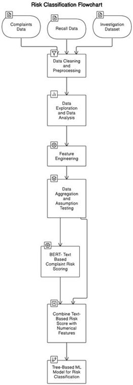

# 🚗 Risk Stratification of Vehicle Complaints: Classifying Risks for Proactive Measures

---

## 📌 Overview

The safety of millions of drivers depends on early detection of vehicle defects. This project builds a **machine learning-based risk classification system** that helps regulators and manufacturers proactively address consumer complaints **before** they escalate into large-scale recalls.

By integrating structured and unstructured data from the **National Highway Traffic Safety Administration (NHTSA)**, this project classifies complaints into **High, Medium, and Low risk categories**, enabling smarter prioritization and faster intervention.

---

## 🧠 Project Goals

- Predict which consumer complaints are likely to lead to **safety investigations or recalls**.
- Classify complaints into **risk tiers** using a combination of BERT NLP and structured data modeling.
- Enable **proactive safety decision-making** in the automotive industry.
- Improve model fairness using **SMOTE, under/oversampling, and cost-sensitive learning**.

---

## 🛠️ Risk Classification Workflow

> **Figure**: A hybrid ML-NLP architecture combining structured vehicle metadata and unstructured complaint descriptions to stratify complaint risk levels.

---

## 📁 Datasets Used

All datasets are sourced from the [NHTSA Open Data Portal](https://www.nhtsa.gov/nhtsa-datasets-and-apis):

| Dataset                 | Records      | Description |
|-------------------------|--------------|-------------|
| Consumer Complaints     | 1.2 million  | User-submitted complaints (since 1995) |
| Recall Records          | 583,000+     | Manufacturer and NHTSA recall actions |
| Defect Investigations   | 306,000+     | Investigations initiated by NHTSA |

---

## 🔍 Key Features Engineered

- **Vehicle Age**: Time since manufacture at complaint date.
- **Time to Report**: Time gap between incident and complaint filing.
- **Seasonality**: Quarterly and yearly complaint trends.
- **Regional Trends**: State-level complaint aggregation.
- **Crash Severity**: Number of injuries, deaths, and police reports.

---

## 📊 Key Findings from EDA

- **Electrical systems** and **engines** are the most reported defect types.
- **Midwest region** reported the highest number of complaints.
- Newer vehicles (1–2 years old) are involved in more crash complaints.
- Manufacturers like **Ford**, **Chevrolet**, and **Toyota** top complaint counts, while **Mercedes-Benz** leads in recalls.

---

## 🤖 ML & NLP Strategy

- **Text Embeddings**: BERT model applied to complaint descriptions for contextual understanding.
- **Structured Data Models**: Random Forest and XGBoost trained on aggregated complaint metadata.
- **Target Variable**: Risk classification (High, Medium, Low) based on historical investigation and recall outcomes.

---

## ⚖️ Addressing Class Imbalance

The dataset is highly imbalanced toward low-risk complaints.

- ✅ **SMOTE + Undersampling** for balancing.
- ✅ **Class-weighted loss functions** in XGBoost.
- ✅ **Synthetic Data Augmentation** to boost minority class samples.

---

## 📈 Current Status

✅ Data Cleaning & Imputation  
✅ EDA & Assumption Testing  
✅ Feature Engineering  
✅ BERT-based Text Risk Scoring  
🔄 Tree-Based Model Training *(In Progress)*  
🔄 Model Evaluation & Deployment Pipeline *(Upcoming)*

---

## 📌 Next Steps

- Finalize model training with hyperparameter tuning.
- Evaluate with AUC-ROC, F1-Score, and Disparity Score for fairness.
- Deploy as a dashboard or alert system to assist regulatory decision-making.

---

## 🔗 References

This project builds upon foundational research including:

- Ghazizadeh et al. (2014) – Complaint Clustering  
- Zhang et al. (2015) – Early Recall Prediction from Forums  
- Maniyur et al. (2017) – Social Media Fusion for Recalls  
- Khodadadi et al. (2021) – Deep Learning for Complaint Classification  
- Maione et al. (2023) – Global Recall Trends

---

---

© 2025 | This project is a research initiative using public datasets by [NHTSA](https://www.nhtsa.gov/).  

